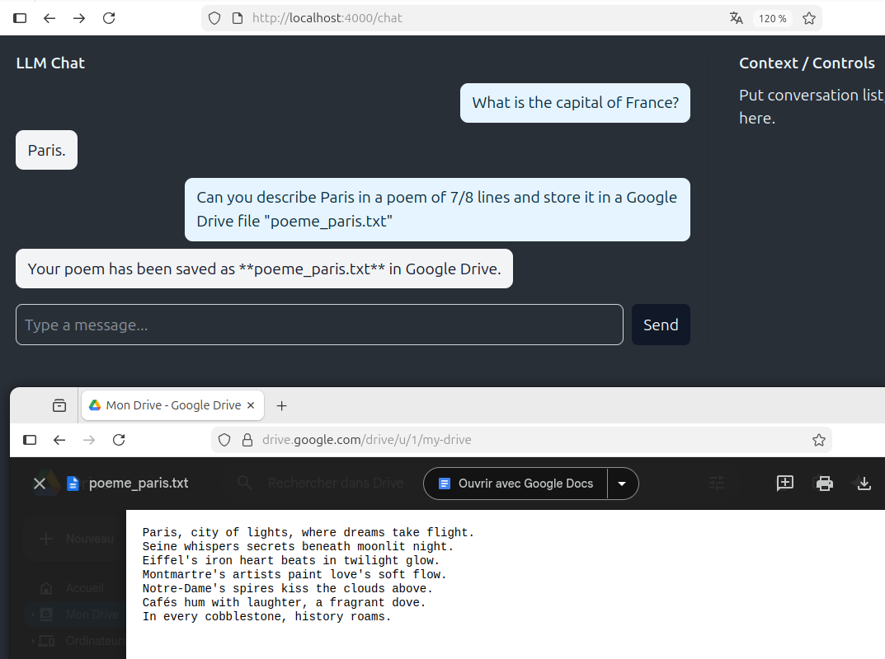

# MyApp

To start your Phoenix server:

* Run `mix setup` to install and setup dependencies
* Start Phoenix endpoint with `mix phx.server` or inside IEx with `iex -S mix phx.server`

Now you can visit [`localhost:4000`](http://localhost:4000) from your browser.

Ready to run in production? Please [check our deployment guides](https://hexdocs.pm/phoenix/deployment.html).

## Learn more

* Official website: https://www.phoenixframework.org/
* Guides: https://hexdocs.pm/phoenix/overview.html
* Docs: https://hexdocs.pm/phoenix
* Forum: https://elixirforum.com/c/phoenix-forum
* Source: https://github.com/phoenixframework/phoenix

# Install LM Studio & MCP Server

## 🔧 LM Studio (local LLM)

To chat here `http://localhost:4000/chat` you need to install **LM Studio** and load a compatible model (we use `openai/gpt-oss-20b` in this project).

- Official site / downloads: https://lmsys.org/
- Install a model (example): download `openai/gpt-oss-20b` in LM Studio and start the app.
- Enable the API endpoint in LM Studio (Settings → Enable API). By default the endpoint used in this project is:

```bash
http://192.168.1.66:1234/v1/chat/completions
```

Quick test with curl:

```bash
curl -X POST "http://127.0.0.1:1234/v1/chat/completions" \
  -H "Content-Type: application/json" \
  -d '{"model":"openai/gpt-oss-20b","messages":[{"role":"user","content":"hello"}]}'
```

> 💡 Note: The host IP and port depend on your LM Studio configuration. Adjust the URL in `lib/llm.ex` if needed.

---

## 🔌 Google Drive MCP Server (google-drive-mcp)

We use the **google-drive-mcp** server for secure Google Drive integration. It can be run via `npx` (recommended) or built as a Docker image.

Repository and docs: https://github.com/piotr-agier/google-drive-mcp

### Requirements
- Node.js 18+ (LTS)
- A Google Cloud Project with Drive/Docs/Sheets/Slides APIs enabled
- OAuth 2.0 desktop credentials (download JSON and rename to `gcp-oauth.keys.json`)

### Quick start (recommended - no install)

```bash
# Run the server directly
npx @piotr-agier/google-drive-mcp

# Optional: run the auth flow interactively
npx @piotr-agier/google-drive-mcp auth
```

### Local clone + Docker (for production / reproducible builds)

```bash
git clone https://github.com/piotr-agier/google-drive-mcp.git
cd google-drive-mcp
cp gcp-oauth.keys.example.json gcp-oauth.keys.json   # edit with your client ID
npm install
npm run build
docker build -t google-drive-mcp .

# Run the container (mount credentials & token file)
docker run -it \
  -v /path/to/gcp-oauth.keys.json:/config/gcp-oauth.keys.json:ro \
  -v ~/.config/google-drive-mcp/tokens.json:/config/tokens.json \
  google-drive-mcp
```

**Important**:
- Authenticate locally first (`npx ... auth`) because Docker cannot open a browser for OAuth.
- Tokens should be stored under `~/.config/google-drive-mcp/tokens.json` (or set `GOOGLE_DRIVE_MCP_TOKEN_PATH`).

### Integration with this app

This project starts a persistent Docker MCP server via `MyApp.MCPBridge` (see `lib/mcp_bridge.ex`) using a Docker command like:

```bash
docker run -i --rm \
  -e GOOGLE_DRIVE_OAUTH_CREDENTIALS=/config/gcp-oauth.keys.json \
  -e GOOGLE_DRIVE_MCP_TOKEN_PATH=/config/tokens.json \
  -v /path/to/gcp-oauth.keys.json:/config/gcp-oauth.keys.json:ro \
  -v ~/.config/google-drive-mcp/tokens.json:/config/tokens.json \
  google-drive-mcp
```

Adjust paths and environment variables as needed for your setup.

---


With MCP tooling: (here Google Drive)


